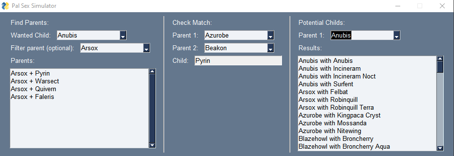

# Pal Sex Simulator

This is a helper to quickly find what pal breeds into what pal in the game Palworld.

## Using the software
This tool has 3 sections that should be relatively self explantory.

**Find Parents:** This section let's you choose a child you want and will give you a list of all the pairs that should give this child. The optional parent filter let's you display only the pairs including that parent.

**Check Match:** This section let's you check the result of breeding 2 specific parents.

**Potential Childs:** This section let's you select a potential parent and will give a list of childs this parent can have if bread with other given pals. The display format is `child with second parent` so `Arsox with Felbat` in the picture above means *Anubis* (the selected parent) can have a child *Arsox* when bread with a *Felbat*.

## Running from source
To run this from source you need python 3 (any recent version) installed. Then follow these steps:

1) Clone this project to your computer: `git clone https://github.com/Speedy321/PalSexSim.git`
    a) (Optional) Create a virtual environment: `py -m venv .env`
    b) (Optional) Activate the virtual environment: `.\.env\Scripts\activate.bat` (on windows command prompt (CMD))
2) Install the required packages: `py -m pip install -r requirements.txt`
3) Run the program: `py main.py`

## Data sources
The data used for this software is taken directly from the spreadsheet published in the following reddit post:
https://www.reddit.com/r/Palworld/comments/19d98ws/spreadsheet_all_breeding_combinations_datamined/

This project and it's author are not affiliated with either u/blahable that made this post, the people that datamined the data, or Pocket Pair the developpers of Palworld.